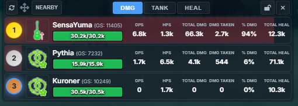

# BPSR Meter

<div align="center">



**A real-time DPS/HPS meter overlay for Blue Protocol Soul Resurrection**

[](https://github.com/NeRooNx/BPSR-Meter/releases)
[](LICENSE)

*Built with Electron and featuring advanced packet sniffing capabilities*

[🚀 Download](#-installation) • [📖 Documentation](#-usage) • [🐛 Report Bug](https://github.com/NeRooNx/BPSR-Meter/issues)

</div>

---

## 🌟 Features

### Core Functionality
- **Real-time DPS/HPS Tracking** - Monitor damage and healing per second with 50ms update intervals
- **Dual View Modes**
  - **Nearby Mode**: Top 10 players + your position (11th) if outside top 10
  - **Solo Mode**: Personal statistics only
- **Multi-Metric Sorting** - Sort by Total Damage, Damage Taken, or Total Healing
- **Channel Change Detection** - Automatically resets statistics when changing game channels

### Visual Features
- **Rank Badges**
  - 🥇 Gold badge for Top 1
  - 🥈 Silver badge for Top 2
  - 🥉 Bronze badge for Top 3
  - 💙 Blue highlight for local player
  - Combined styling when local player is in top 3
  - Minimalistic style
- **Class Icons** - Visual identification of player classes and specializations
- **HP Bars** - Real-time health tracking with color-coded indicators
- **Damage Percentage Bars** - Visual representation of damage contribution
- **Position-based Background Colors** - Gradient coloring from 1st to 10th place

### Window Management
- **Click-through Mode** - Transparent to mouse clicks when unlocked
  - Automatically activates on hover over controls
  - Returns to click-through when mouse leaves
- **Draggable Window** - Move the overlay anywhere on screen
- **Lock Position** - Prevent accidental movement
- **Always on Top** - Stays visible over the game
- **Frameless & Transparent** - Modern overlay design

## 📋 Requirements
- **Windows OS** (Windows 10/11 recommended)
- **Npcap** (WinPcap alternative for packet capture)
- **Blue Protocol Soul Resurrection** game client

## 🚀 Installation

### Option A: Using the Installer (Recommended for Users)

1. **Install Npcap**
   - Download and install [Npcap](https://npcap.com/#download) with these options:
     - ✅ Install Npcap in WinPcap API-compatible Mode
     - ✅ Support loopback traffic

2. **Download the Installer**
   - Go to [Releases](https://github.com/NeRooNx/BPSR-Meter/releases)
   - Download the latest `BPSR Meter Setup X.X.X.exe`

3. **Install**
   - Run the installer and follow the instructions
   - Launch from Start Menu or Desktop shortcut

4. **Important: Initial Setup**
   - ⚠️ After launching the meter, you **must change instance** (use a teleport) or **change line** for the meter to start detecting players
   - The meter needs to capture the initial player data packets when entering a new instance/channel

### Option B: Running from Source (For Developers)

1. **Install Npcap** (same as Option A)

2. **Clone Repository**
```bash
git clone https://github.com/NeRooNx/BPSR-Meter.git
cd BPSR-Meter
```

3. **Install Dependencies**
```bash
npm install
# or
pnpm install
```

4. **Run the Application**
```bash
npm start
```

## 🎮 Usage

### Basic Controls
- **Nearby/Solo Button** - Toggle between group and personal view
- **DMG/TANK/HEAL Buttons** - Change sorting metric (Nearby mode only)
- **Sync Button** (🔄) - Manually refresh data
- **Lock Button** (🔒/🔓) - Lock/unlock window position
- **Drag Handle** (⋮⋮) - Drag to move window
- **Close Button** (✕) - Exit application

### View Modes

#### Nearby Mode
Shows top 10 players sorted by selected metric. If you're outside the top 10, you'll appear as the 11th entry with your actual position number.

#### Solo Mode
Displays only your personal statistics without comparison to others.

### Sorting Options (Nearby Mode Only)
- **DMG** - Sort by total damage dealt (default)
- **TANK** - Sort by damage taken
- **HEAL** - Sort by total healing done

### Window States

#### Unlocked (Default)
- Window is click-through (transparent to clicks)
- Hover over controls to interact with buttons
- Can be dragged by the drag handle
- Mouse passes through player bars

#### Locked
- Position is fixed, cannot be dragged
- Still click-through except for essential buttons
- Prevents accidental movement during combat

### Building for Production

#### Windows Executable
```bash
npm run build:win
```

Output will be in the `dist` folder.

## 🎨 Customization

### Changing Colors
Edit `public/css/style.css` and modify the CSS variables:
```css
:root {
    --bg-dark: rgba(15, 20, 30, 0.42);
    --accent-primary: #4a9eff;
    --text-primary: #ffffff;
    /* ... more variables */
}
```

### Adjusting Update Rate
In `public/js/main.js`, change the interval:
```javascript
setInterval(fetchDataAndRender, 50); // 50ms = 20 updates/second
```

## 🐛 Troubleshooting

### "Npcap not detected"
- Ensure Npcap is installed with WinPcap compatibility mode
- Run the application as Administrator
- Restart your computer after Npcap installation

### "No game server detected"
- Make sure Blue Protocol is running
- Check your network adapter selection in the logs
- Verify firewall isn't blocking the application

### Meter not showing data
- **Change instance or channel** - Use a teleport or manually change channels
- The meter requires fresh player data packets to start tracking
- If still not working, try restarting the meter after entering a new instance

### Window not responding to clicks
- This is normal behavior when unlocked
- Hover over the window to activate controls
- Use the lock button if you want it always clickable

## 🐞 Known Issues

### Player names showing as "Unknown"
Sometimes the meter may display player names as "Unknown" with missing HP values. This occurs when:
- The player data packets are not fully captured during initial load
- Network packet loss or delayed packet arrival
- Players joined the instance before the meter was started
- **Workaround**: Change instance/channel to force a refresh of player data
- **Note**: The sync button (🔄) only refreshes the display, it cannot fix "Unknown" players

### Data synchronization
- The meter needs to capture specific network packets when players first appear in your instance
- If you open the meter after already being in an instance with other players, you **must change instance or channel** for proper detection
- This is a limitation of packet-based detection and cannot be avoided

## 📝 License

This project is a fork and heavily modified version of the original BPSR Meter. 

Forked from the work of: [MrSnakke](https://github.com/mrsnakke/BPSR-Meter) who based on the original repository: [StarResonanceDamageCounter](https://github.com/dmlgzs/StarResonanceDamageCounter)

## 🙏 Credits

- **dmlgzs** - Original BPSR Meter implementation
- **Npcap** - Packet capture library
- **Electron** - Desktop application framework
- **Font Awesome** - Icons

See [AUTHORS.md](AUTHORS.md) for detailed contributor information.

## 🤝 Contributing

Contributions are welcome! Please feel free to submit a Pull Request.

### Development Guidelines
1. Follow existing code style
2. Test thoroughly before submitting PR
3. Update documentation for new features
4. Commit messages should be clear and descriptive

## ⚠️ Disclaimer

> ### Responsible Use
> This tool is designed to help you improve your own performance. **Please do not use it to degrade, harass, or discriminate against other players.** The goal is personal improvement and enjoying the game as a community.


---

**Made with ❤️ by the BPSR community**
